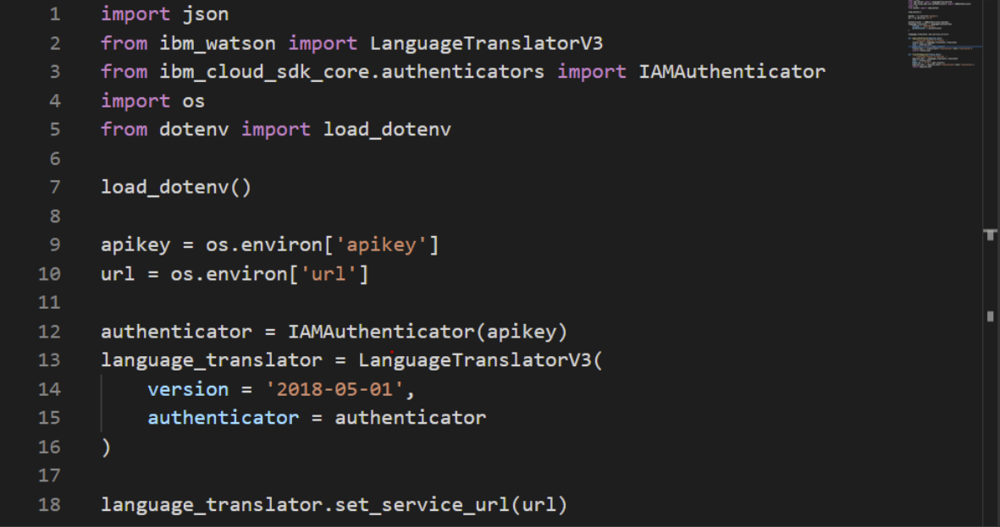
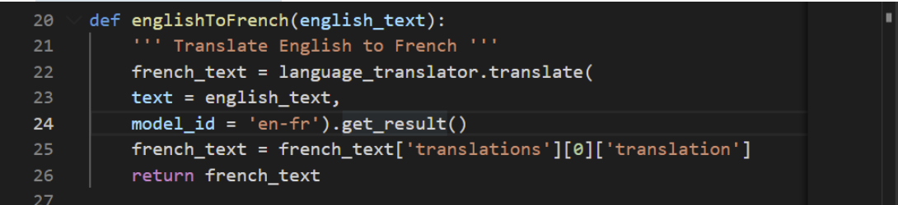
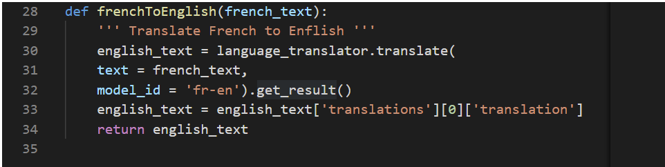
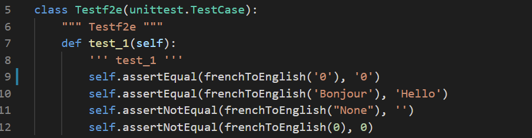
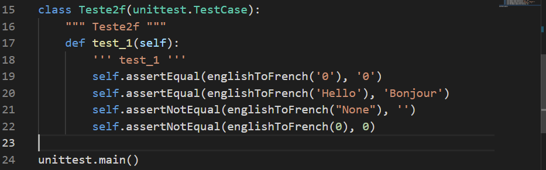
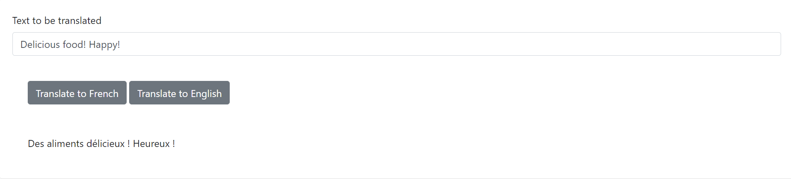

# IBM Python Project for AI Application Development

## Project Breakdown

**Prework: Sign up for IBM Cloud Lite account and create a Watson Language Translator service.**

1. Create an IBM Cloud Lite account
2. Create an instance of the Watson Language Translator.

**Create Python Server side**

- Create two functions, one to translate from English to French and the other to translate from French to English in translator.py
  - The central part of the codes is shown below:
  - 
  - 

- Write unit tests to test the two functions
  - The central part of the codes is shown below:
  - 
  - 

- Package the above functions and tests as a standard python package
- Import the package in server.py, and test functions on local server.
  - French to English example:
  - 
  - English to French example:
  - 
- Deploy the application on IBM Cloud, for further use
  - Maybe I 'll add it to my website! Sounds Great!😋
  - Now I am trying to add a auto-chatbot🤖  to my website! HAHA! 

